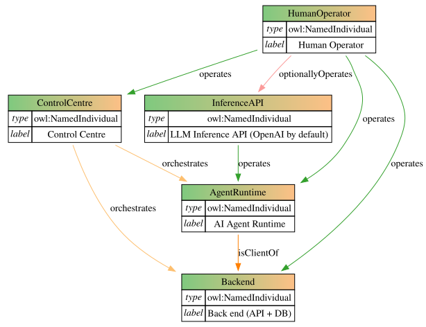

# KTP HCR Detour: AI Augmentation

A reproducible architecture for running an isolated AI agent against a task-oriented backend API.

The Agent Runtime pulls work from the Backend, uses an Inference API to complete it, and pushes the result back. A Human Operator deploys, operates, and reviews the system through a Control Centre.

## Architecture



_Figure 1. Architecture of the AI Augmentation Detour of the KTP HCR Pipeline. `owl:NamedIndividual` indicates that each node is declared as an individually identifiable entity in the ontology._

**Abbreviations:** AI, artificial intelligence; API, application programming interface; DB, database; HCR, [Highly-Cited Researcher][clarivate-hcr]; KTP, [Knowledge Translation Program][ktp]; LLM, [large language model][google-kg-llm]; OWL, [Web Ontology Language][owl2]; RDF, [Resource Description Framework][rdf11].

----

The architecture contains five separate entities (Figure 1).

* **Human Operator** — operates the Control Centre, AI Agent Runtime, and Backend. The operator may also operate the Inference API when it is self-hosted.
* **Control Centre** — orchestrates the AI Agent Runtime and Backend.
* **AI Agent Runtime** — runs the agent and acts as an API client of the Backend.
* **Inference API** — provides large language model (LLM) inference to the AI Agent Runtime. OpenAI is the default provider (some alternatives: OpenRouter, Ollama).
* **Backend** — exposes the task API and stores application data, logs, and submissions.

The AI Agent Runtime and Backend must be deployed as separate systems. The Backend may run on the Control Centre host or on another server, but it must not run inside the AI Agent Runtime. The AI Agent Runtime must not run on the Control Centre host except as a guest virtual machine (VM, e.g., Lima on macOS).

The LLM Inference API accesses the Backend API by operating the AI Agent Runtime; more precisely, the API calls are invoked by the Runtime itself whereas generative outputs of _some_ of these calls trigger tools on the Runtime as in routine [LLM function calling][openai-function-calling].

The LLM Inference API and the AI Agent Runtime are not authorized to access the Backend proper except via the exposed Backend API.

Neither the LLM Inference API nor the AI Agent Runtime is authorized to access the Control Centre.

## Runtime Workflow

1. The Human Operator deploys\* the Backend API.
1. The Human Operator provisions\* or starts the AI Agent Runtime.
1. The Human Operator connects\* to the AI Agent Runtime over the SSH (Secure Shell) protocol and initiates\* a request to the LLM Inference API (e.g., by sending a prompt into the chat interface of the [OpenAI Codex Visual Studio Code extension][codex-vsce]).
1. The AI Agent Runtime, operated by the LLM Inference API, retrieves a task (e.g., a highly-cited researcher profile to augment) from the Backend API `/pull` endpoint.
1. The AI Agent Runtime works on the task by dispatching sequential\*\* requests to the LLM Inference API while the Inference API triggers tools (e.g., Linux shell commands) on the Runtime at its discretion.
1. At some point during the rollout, the AI Agent Runtime is expected to push the result to the Backend API.
1. Upon receipt of a `/push` payload, the Backend API records receipt, validates the payload, and communicates an automated response to the AI Agent Runtime.
1. The rollout continues until the AI Agent Runtime hits a `task_complete` event, as triggered by the LLM Inference API.
1. Once the Agent Runtime has marked the task as completed, it stops operation and remains idle until rehydrated by the Human Operator.
1. The Human Operator reviews Backend logs and submissions and repeats or adjusts the workflow as necessary.
1. Multiple tasks (e.g., HCR profiles) may be passed by the Human Operator to the AI Agent Runtime in a single batch; in this instance the rollout is expected to continue and only trigger a `task_complete` even once the batch is exhausted, though this is ultimately at the discretion of the LLM Inference API.

\* Either manually or via orchestration through the Control Centre.

\*\* Note that the [Multi-agent mode][openai-multi-agent] is disabled in this AI Agent Runtime.

## Directory contents and lockfile

This section is intended to capture the specifics of the workflow operation in sufficient detail to be reproduced.

> [!NOTE]
> Note that the behaviour of the LLM Inference API, unless self-hosted and specially provisioned (not by default), is fundamentally irreproducible. As such, it is only recorded as observed as an audit trail (e.g., as a OpenAI Codex JSON Lines rollout).
>
> The decision not to self-host an LLM Inference API was driven by the fact that the augmentation pipeline depends heavily on web search and web page retrieval, which are inherently irreproducible as usually implemented. For example, the open source [Tongyi Deep Research][tongyi] pipeline, while supporting open-weight models, still relies on third-party services such as Serper for web search or Jina for web page retrieval, substantially relaxing end-to-end reproducibility guarantees in general. Additionally, frontier agentic set-ups such as OpenAI Codex often offer [superior][artificial-analysis-coding-agents] performance on tasks such as software engineering, as well as across the board.

**Control Centre:** Requires no specialized infrastructure beyond a computer capable of operating the workflow components, including sufficient computing resources and internet access. The test set-up (hereafter: the main host) used a Mac16,12 Macbook Air (Apple M4 chip) in a 10-core, 24 GB RAM, 512 GB SSD configuration, running macOS Sequoia 15.6.1 and Visual Studio Code 1.130.0, though these versions were not pinned and may have been updated moving forward.

**AI Agent Runtime:** Deployed under the main host to a [Lima virtual machine version 2.1.1][lima211] using `./src/agent_runtime/deploy.sh`.

**Backend:** Deployed on the host machine using `./src/backend/api.py` in this (i.e., the `detour_ai_augment` “detour” of the KTP HCR pipeline) environment.

<!---Unreviewed AI slop below
## Components

### Human Operator

The Human Operator owns the deployment and operation of the complete system.

Typical responsibilities include:

* provisioning infrastructure;
* configuring credentials;
* starting and stopping services;
* connecting to the Agent Runtime;
* reviewing Backend logs and submissions;
* updating pinned software versions;
* operating the Inference API when it is self-hosted.

### Control Centre

The Control Centre is the operator-facing machine used to deploy, configure, access, and observe the system.

It contains:

* a pinned VS Code version;
* a pinned Remote SSH extension;
* an optional pinned Codex VS Code extension;
* SSH access to the Agent Runtime;
* administrative access to the Backend;
* access to Backend logs and submissions.

The Codex VS Code extension belongs on the Control Centre. It is an operator interface and is not required for unattended execution inside the Agent Runtime.

### Agent Runtime

The Agent Runtime is a clean, isolated Ubuntu environment in which the agent executes.

It contains:

* a pinned Ubuntu image;
* pinned operating-system dependencies;
* a pinned Codex CLI version;
* a pinned Codex configuration;
* a dedicated runtime user;
* a dedicated working directory;
* network access to the Backend API;
* network access to the Inference API;
* SSH access from the Control Centre.

The Agent Runtime is the Backend API client. It pulls tasks and pushes completed results.

The Agent Runtime must not have direct access to:

* Backend source data;
* ground-truth data;
* Backend databases;
* Backend submission directories;
* Backend logs;
* unnecessary host files or directories.

### Inference API

The Inference API provides model inference to the Agent Runtime.

OpenAI is the default provider, but the architecture does not require a specific provider. The Inference API may be externally hosted or operated by the Human Operator.

The Inference API communicates with the Agent Runtime. It does not communicate directly with the Backend.

### Backend

The Backend owns the task data, validation, persistence, logs, and submissions.

The current FastAPI implementation exposes:

* `GET /pull` — streams an NDJSON task to the Agent Runtime;
* `POST /push` — validates and stores the completed submission.

For each accepted submission, the Backend writes:

```text
submissions/<timestamp>/response.jsonl
submissions/<timestamp>/response.md
```

`response.jsonl` contains the submitted result followed by the ground truth.

`response.md` contains a human-readable comparison for review.

## Reproducibility

All relevant versions should be explicitly recorded in source control.

For example:

```dotenv
# Control Centre
VS_CODE_VERSION=
REMOTE_SSH_EXTENSION_VERSION=
CODEX_EXTENSION_VERSION=

# Agent Runtime
UBUNTU_IMAGE_URL=
UBUNTU_IMAGE_SHA256=
CODEX_CLI_VERSION=

# Backend
BACKEND_VERSION=
PYTHON_VERSION=
```

Version ownership is divided as follows:

| Dependency              | Location                               |
| ----------------------- | -------------------------------------- |
| VS Code                 | Control Centre                         |
| Remote SSH extension    | Control Centre                         |
| Codex VS Code extension | Control Centre, optional               |
| VS Code Server          | Agent Runtime, installed by Remote SSH |
| Ubuntu image            | Agent Runtime                          |
| Codex CLI               | Agent Runtime                          |
| Codex configuration     | Agent Runtime                          |
| Backend application     | Backend                                |
| Database schema         | Backend                                |

A full VS Code desktop installation is not required inside the Agent Runtime. Remote SSH installs the matching VS Code Server when the Control Centre connects.

## Provisioning

The provisioning implementation may use Lima, a cloud VM, a container, a dedicated server, or another isolation mechanism.

The architecture depends on the resulting runtime contract rather than a particular provisioning provider.

A provisioned Agent Runtime must provide:

* the expected Ubuntu version;
* the expected architecture;
* the expected Codex CLI version;
* the expected Codex configuration;
* a writable working directory;
* SSH connectivity;
* Backend API connectivity;
* Inference API connectivity;
* isolation from Backend storage.

The current Lima implementation already defines:

* the Ubuntu image;
* CPU, memory, and disk resources;
* the runtime user and home directory;
* the mounted working directory;
* the Codex configuration;
* SSH verification;
* working-directory verification;
* recreation of a clean runtime.

It should additionally:

* install an explicitly pinned Codex CLI version;
* verify the Ubuntu image checksum;
* verify the installed Codex CLI version;
* avoid mounting Backend files into the Agent Runtime;
* load credentials from a secret-management mechanism;
* record the complete version matrix in source control.

## Command Naming

For a reusable command that creates, verifies, starts, and enters the runtime, use:

```text
agent-runtime
```

For a one-shot provisioning script, use:

```text
provision-agent-runtime.sh
```

`deploy.sh` is less precise because the script provisions only the Agent Runtime rather than deploying the complete architecture.

Example layout:

```text
bin/
  agent-runtime

scripts/
  provision-agent-runtime.sh

assets/
  hcr_augment_agent_architecture.svg
```

## API Interaction

Pull a task:

```bash
curl -N http://backend.example/pull
```

Submit a completed task:

```bash
curl -N \
  -H 'Content-Type: application/json' \
  --data @submission.json \
  http://backend.example/push
```

The Agent Runtime should receive the Backend base URL through configuration rather than embedding it in the runtime image.

For example:

```bash
export HCR_BACKEND_URL="https://backend.example"
```

## Security Boundary

The central security boundary is between the Agent Runtime and the Backend.

The Agent Runtime should be treated as an isolated and potentially destructive execution environment. It should receive only:

* the task returned by the Backend API;
* the credentials required for permitted API operations;
* the source repository or working files required for the task;
* access to the configured Inference API.

The Backend retains:

* authoritative source data;
* ground truth;
* submission history;
* application logs;
* database access;
* validation logic;
* operator review artefacts.

Even when the Codex sandbox is configured with unrestricted local access, that access remains confined to the isolated Agent Runtime.

## Design Principles

* Keep the Agent Runtime and Backend separate.
* Make the Agent Runtime an API client, not a data-store peer.
* Keep human operation distinct from software orchestration.
* Pin all software that affects execution.
* Provision clean runtimes reproducibly.
* Give the agent only the access required for its task.
* Keep Backend data and ground truth outside the Agent Runtime.
* Ensure all inference-mediated Backend activity passes through the Agent Runtime.
--->

[ktp]: https://knowledgetranslation.net/featured-project-research-integrity-project-exploring-diversity-in-clarivates-highly-cited-researchers-list/ "Knowledge Translation Program"

[clarivate-hcr]: https://clarivate.com/highly-cited-researchers/ "Clarivate Highly Cited Researchers"

[owl2]: http://www.w3.org/TR/owl2-overview/ "OWL 2 Web Ontology Language Document Overview: W3C Recommendation"

[rdf11]: http://www.w3.org/TR/rdf11-concepts/ "RDF 1.1 Concepts and Abstract Syntax: W3C Recommendation"

[google-kg-llm]: https://www.google.com/search?kgmid=/g/11kc9956b3 "Large language model - Google Knowledge Graph ID"

[openai-function-calling]: https://developers.openai.com/api/docs/guides/function-calling "Function calling | OpenAI Developers"

[codex-vsce]: https://marketplace.visualstudio.com/items?itemName=openai.chatgpt "Codex – OpenAI’s coding agent | Visual Studio Code Marketplace"

[openai-multi-agent]: https://developers.openai.com/api/docs/guides/responses-multi-agent "Multi-agent | OpenAI Developers"

[lima211]: https://github.com/lima-vm/lima/releases/tag/v2.1.1 "lima release v2.1.1 | GitHub"

[tongyi]: https://github.com/Alibaba-NLP/DeepResearch "Tongyi Deep Research | GitHub"

[artificial-analysis-coding-agents]: https://artificialanalysis.ai/agents/coding-agents "Artificial Analysis Coding Agent Benchmarks | Artificial Analysis"
